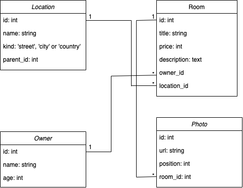

<h1 align="center">
  <br>
  </a>
  <br>
  Pilotes Squad
  <br>
</h1>

<h4 align="center">The new disruptive way of searching rooms</h4>

<p align="center">
  <a>
    
  </a>
  <a >
	</a>
  <a >
    
  </a>
</p>

<p align="center">
	<strong>
		<a href="https://github.com/corintoz/badigeeks-api#requirements-pushpin">Requirements</a>
		•
		<a href="https://github.com/corintoz/badigeeks-api#first-setup-computer">First setup</a>
		•
		<a href="https://github.com/corintoz/badigeeks-api#gems-gem">Gems</a>
		•
		<a href="https://github.com/corintoz/badigeeks-api#endpoints-round_pushpin">Endpoints</a>
	</strong>
</p>

# Room search API based on Badi :bread:
This project is a RoR API that reproduces the main behavior of [Badi](https://badi.com/es).
The main features that our API implements are:

 - Search locations based on user input
 - Search rooms by location (bounding box)
 - Detailed room representation
 -  Similar rooms based on location and price
 
## Requirements :pushpin:
 - Ruby 2.6.5
 - Rails > 6.0.2.1
 - PostgreSQL 12
 - PostGIS 12

## First setup :computer:
Make sure all [requirements](https://github.com/CorintoZ/badigeeks-api#Requirements) are available and clone the repository:
```bash
git clone https://github.com/assimovt/badigeeks-api.git
```
Install all the gems
```bash
$ bundle install
```
As the project uses dotenv, you must setup your environment credentials in side a new file:
```bash
$ cp .env .env.development.local
```
Once the credentials for the database are set, you should create the database
```bash
$ rails db:create
```

## Gems :gem:

- [Activerecord-postgis-adapter](https://github.com/rgeo/activerecord-postgis-adapter)

- [Brakeman](https://github.com/presidentbeef/brakeman)

- [Database_cleaner](https://github.com/DatabaseCleaner/database_cleaner)

- [Factory_bot_rails](https://github.com/thoughtbot/factory_bot_rails)

- [Faker](https://github.com/faker-ruby/faker)

- [Geocoder](https://github.com/alexreisner/geocoder)

- [Grape](https://github.com/ruby-grape/grape)

- [Grape-entity](https://github.com/ruby-grape/grape-entity)

- [Pagy](https://github.com/ddnexus/pagy)

- [Pg](https://github.com/ged/ruby-pg/)

- [Rspec-rails](https://github.com/rspec/rspec-rails)

- [Rubocop-rails](https://github.com/rubocop-hq/rubocop-rails)

- [Shoulda-matchers](https://github.com/thoughtbot/shoulda-matchers)

- [Simplecov](https://github.com/colszowka/simplecov)

## Endpoints :round_pushpin:

-   GET Location query
	- URI: /locations?keyword=place
	- Return all the locations that match the keyword parameter
	- Uses [Nominatim]([http://nominatim.org/](http://nominatim.org/)) as search engine
	- [Working exemple](https://desolate-cove-97654.herokuapp.com/api/v1/locations?keyword=poble+sec)
    
 

| Mandatory params  | Value | Notes |
| :---         |     :---         |     :---   |
| keyword  | “Any place you want to search rooms”     | Must contain at least 3 letters to work properly    |


-   GET List rooms
	- URI: /rooms?bounds=2.109375,41.345887,2.254601,41.445557&page=1&size=20&order_type=price&order=ASC
	- Return all the rooms within the perimeter
	- [Working example](https://desolate-cove-97654.herokuapp.com/api/v1/rooms?bounds=2.109375,41.345887,2.254601,41.445557&page=1&size=30&order_type=price&order=asc&min=300&max=650)
    
 

| Mandatory params  | Value | Notes |
| :---         |     :---         |     :---   |
| bounds |  “minimumLongitude, minimumLatitude, maximumLongitude, maximumLatitude”     | Bounds represents the square where you want to look for rooms    |

| Optional params  | Value | Notes |
| :---         |     :---         |     :---   |
| page |  1…*     | Overflow is handled    |
| size|  1…*     | Specify how many items per page. Overflow is handled   |
| order_type|  “the attribute you want to use to sort”     |  You can only sort by “price” at the moment  |
| order| [ASC, asc, DESC, desc]    |   |
| min| 1...10000 | Limit minimum price  |
| max| 1...10000 | Limit maximum price  |


-   GET Specific room
	- URI: /rooms/:id
	- Return the details of a specific room by the room id
	- [Working example](https://desolate-cove-97654.herokuapp.com/api/v1/rooms/62e04ce0-dd26-4ea6-9099-5aa80ebbe149)


## Models structure and associations :hammer:
The current approach for the model structure can be found in the image below. It includes the defined models with its fields and associations among them.

<p align="center">
  
</p>


## Fill the database :floppy_disk:

In order to fill the database, you will have to execute the following command:
```bash
rake badi_api_request: request_fill_db
```
This task scrapes the data from Badi’s API in order to use real data.
